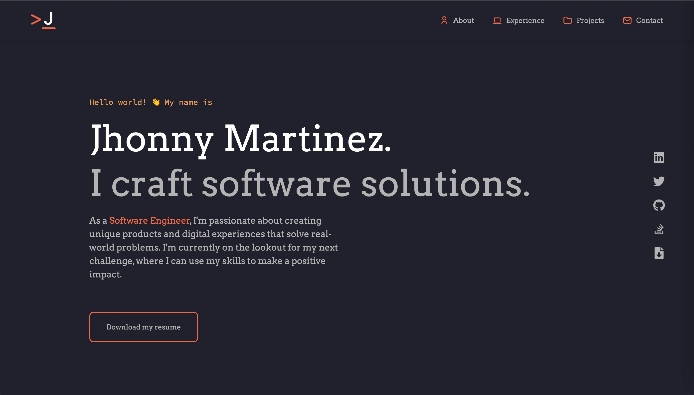

  
  <h1>jfmartinez.dev</h1>

The first version of my [personal website](https://jfmartinez.dev). It's a simple portfolio website that showcases my projects and skills. It's built with [NextJS](https://nextjs.org/) and [TailwindCSS](https://tailwindcss.com/).

  
  

## Installation :wrench:

To install the project, follow these steps:

1. Clone the repository
2. Run `npm install` to install the dependencies

## Usage :rocket:

To use the project, follow these steps:

1. Run `npm run dev` to start the development server
2. Open [http://localhost:3000](http://localhost:3000) with your browser to see the result.

## License

This project is licensed under the MIT license. See the `LICENSE` file for more information.
